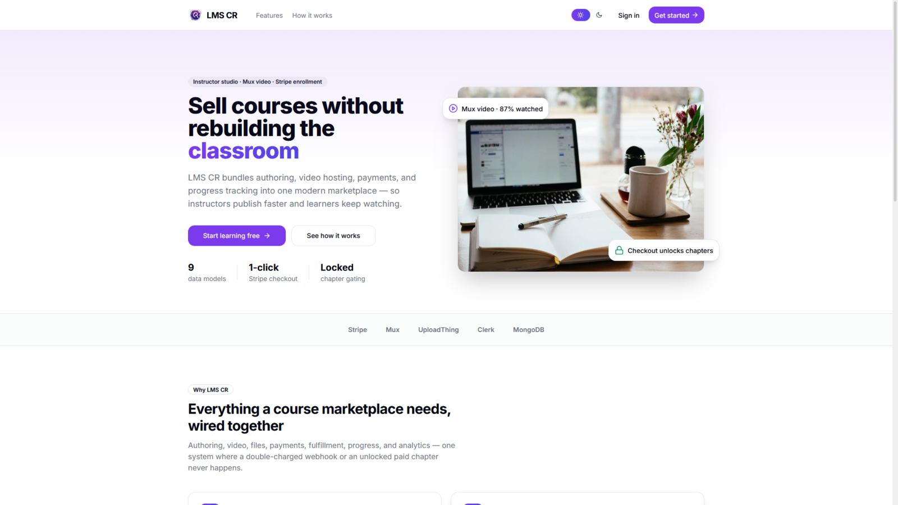
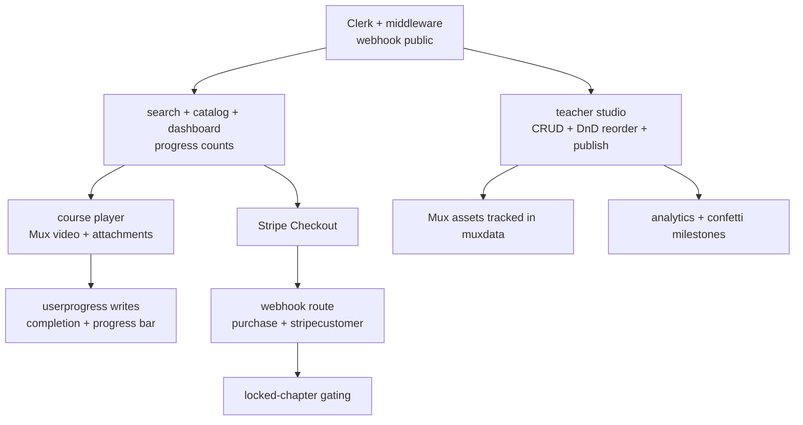
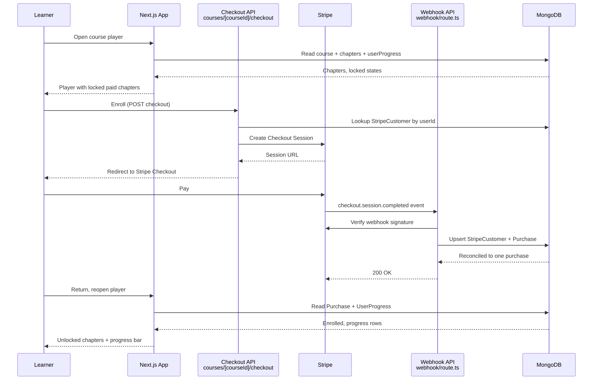

# LMS CR

> Full-stack course marketplace: instructor studio, Mux video, Stripe enrollment, progress gating, and sales analytics.

**Stack:** Next.js 14.2.3 · React 18 · Clerk 5 · Mongoose/MongoDB · Stripe · Mux · UploadThing · Node 24



| Fact | Evidence |
| --- | --- |
| Paid loop end-to-end | Course CRUD → Stripe Checkout → webhook → `purchase`/`stripecustomer` → locked-chapter gating |
| 9 Mongoose models | course, chapter, category, attachment, purchase, userprogress, muxdata, profile, stripecustomer |
| Video + files + money wired | `@mux/*`, `uploadthing`, `stripe` deps with dedicated routes and asset tracking |
| 46 commits with a DnD war story | `Tried different drag and drop` → `Fixed: Dnd Reorder Issue` |

## The Problem

Selling courses without a marketplace means solving authoring, video hosting, file attachments, payments, fulfillment, progress tracking, and analytics as one system — where a double-charged webhook or an unlocked paid chapter destroys trust instantly.

## The Solution

A monolithic App Router app: API routes own mutations, Mongoose owns persistence, Stripe/Mux/UploadThing own money/media/files. Learners browse, enroll via Checkout, and watch gated chapters; instructors author with drag-reorderable chapters and Mux uploads; webhooks reconcile purchases exactly once.



## Key Features

**Course player with gating.** Mux video, attachments, completion toggles, progress bars; unpaid chapters render locked. Why it matters: gating is the product promise of a paid course.

**Stripe enrollment.** Checkout sessions fulfilled by webhook into `purchase`/`stripecustomer` records. Why it matters: money must reconcile exactly once under at-least-once delivery.

**Instructor studio.** Course table (TanStack), chapter CRUD with drag reorder, Mux uploads, publish/unpublish. Why it matters: authoring speed decides catalog growth.

**Search and analytics.** Category search, purchase aggregation, dashboard counts. Why it matters: learners find courses; instructors measure them.

## Key Engineering Decisions

**Problem → Constraint → Decision → Tradeoff → Result**

1. **Webhooks deliver at-least-once.** Constraint: naive handlers double-fulfill on retries. Decision: dedicated checkout + webhook routes with `stripecustomer` mapping so fulfillment reconciles to one purchase. Tradeoff: an extra customer-mapping model to maintain. Result: reliable enrollment — routes plus model are the evidence.

2. **Upload URLs are ephemeral.** Constraint: playback breaks if only transient URLs are kept. Decision: Mux assets tracked durably in `muxdata` alongside UploadThing uploads. Tradeoff: asset lifecycle bookkeeping per chapter. Result: stable playback references.

3. **Chapter ordering UX.** Constraint: one DnD library couldn't cover every list cleanly. Decision: iterated (`@dnd-kit` + `@hello-pangea/dnd`) until the reorder issue was fixed (`86eb9b2`). Tradeoff: two DnD dependencies in one codebase. Result: working drag reorder in the studio.

## Iteration Story

Forty-six commits: `create-next-app` → Clerk auth → database modals → chapter-edit forms with Mux → DnD attempts and fix → Stripe with full functionality → metadata/layout/theme passes → engine pin → docs PR. Money and media landed as full subsystems, not stubs; the DnD fix sequence shows a real struggle resolved, not a first-try success.

## User Experience

Learners sign in to a dashboard of in-progress/completed counts, search the catalog, open a course, and watch — toggling completion as progress advances, hitting locked states until Checkout completes. Instructors switch to the studio: create, fill chapters with video and attachments, reorder by drag, publish, and review analytics. Confetti marks milestones.

## Results & Evidence

**Verifiable:** checkout/webhook routes, `stripecustomer` reconciliation, `muxdata` tracking, and the DnD fix all committed; 13-key `.env.example` documents the full integration surface.

**Not claimed:** no test suite or revenue/usage metrics are recorded.

## Technical Details

| Area | Detail |
| --- | --- |
| Framework | Next.js 14.2.3, React 18, Tailwind 3.4, Node 24 engines |
| Auth | `@clerk/nextjs`, `middleware.ts` (webhook public) |
| Data | `mongoose` + `mongodb`, 9 models, `connectToDatabase()` (collections on first write) |
| Money/media/files | `stripe`, `@mux/mux-node` + player, `uploadthing` |
| Forms/state | `react-hook-form` + `zod`, `zustand`, TanStack Table, `recharts` |
| Secrets | `.env.example` (13 keys: Clerk ×6, `MONGODB_URL`, UploadThing ×2, Mux ×2, app URL, Stripe ×2). Nothing committed. |

## Setup

1. **Prerequisites:** Node 24, npm, MongoDB (Atlas or local), Clerk, Stripe, Mux, UploadThing accounts; Stripe CLI for webhook testing.
2. **Clone and install:**
   ```bash
   git clone https://github.com/LowkeyGud/lms-cmregmi.git
   cd lms-cmregmi
   npm install
   ```
3. **Environment:** copy `.env.example` to `.env` and fill all 13 keys.
4. **Webhooks (local):** `stripe listen --forward-to localhost:3000/api/webhook`.
5. **Run:**
   ```bash
   npm run dev
   ```
   Production: `npm run build` then `npm start`, with the production webhook URL registered.
6. **Verify:** create a course as instructor, enroll via test Checkout, confirm purchase record and chapter unlocking, toggle completion and watch progress advance.
7. **Common issues:** webhook signature failure → CLI forwarding misconfigured; Mux playback blank → token pair mismatch; locked chapters after payment → purchase reconciliation check.

No GitHub Actions workflow is committed in this repo.

## Lessons / Takeaways

- At-least-once webhooks demand reconciliation design up front — the customer-mapping model was load-bearing, not boilerplate.
- Dual DnD libraries were pragmatic, not elegant; the reorder fix mattered more than dependency purity.
- Next step is fulfillment tests around the webhook handler — the highest-risk untested code in the repo.

## Links

- Repository: `https://github.com/LowkeyGud/lms-cmregmi`
- Live Demo: `https://lms-cmregmi.vercel.app`

## Diagrams

Generated from the codebase with the mermaid-skill workflow (validate via Kroki → export SVG → vision self-check). Sources live in `docs/diagrams/` — edit the `.mmd`, re-render, review. SVG is the committed format: lossless zoom, small files, no dark-canvas bugs.

**Entity-relationship** (`docs/diagrams/er.mmd` — all 9 models + logging, refs from `database/*.modal.ts`):



**Enrollment sequence** (`docs/diagrams/enrollment-sequence.mmd` — Checkout → Stripe → webhook → gating):



## Screenshots

Captured from the live deployment:


